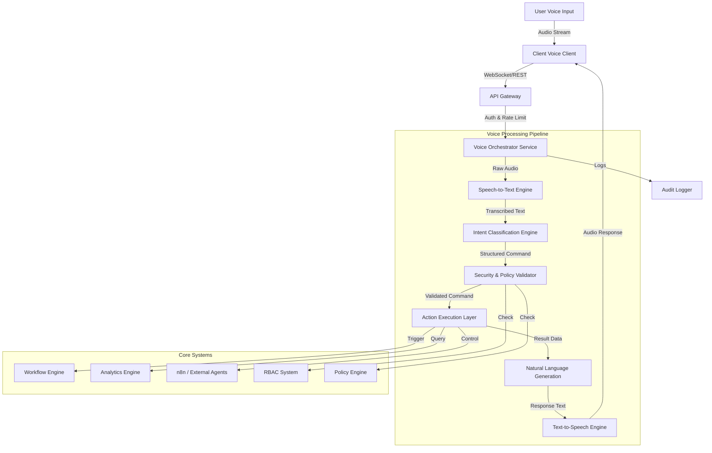

# AI-BOS Voice Agent System Design

## 1. Architecture Blueprint

The Voice Agent System is designed as a layered micro-service architecture integrated into the AI-BOS core.



## 2. Voice Pipeline Design

### 2.1 Input Layer
- **Protocol**: WebSocket (for streaming) or REST (for chunked audio).
- **Format**: WebM/OPUS or WAV (16kHz, Mono).
- **VAD (Voice Activity Detection)**: Client-side (e.g., Silero VAD) to reduce bandwidth.

### 2.2 STT Engine (Speech-to-Text)
- **Primary**: OpenAI Whisper (Large-v3) running on GPU worker nodes.
- **Fallback**: Google Cloud Speech-to-Text (if local inference fails/high latency).
- **Language Support**: Auto-detect [uz, ru, en].

### 2.3 Intent Engine
- **Model**: Fine-tuned LLM (e.g., Gemini 1.5 Flash or Llama 3) optimized for JSON extraction.
- **Context Window**: Maintains last 5 turns for conversational context.

## 3. Intent Classification Structure

Standardized JSON output from the Intent Engine:

```json
{
  "intent": "finance.report",
  "confidence": 0.98,
  "entities": {
    "metric": "roi",
    "period": "last_month",
    "department": "marketing"
  },
  "requires_confirmation": false
}
```

**Supported Intents:**
- `finance.report`: Query financial metrics.
- `marketing.optimize`: Adjust ad spend/campaigns.
- `crm.summary`: Get lead/deal summaries.
- `workflow.trigger`: Start an automation.
- `system.status`: Check platform health.
- `ai.explain`: Request analysis of a data point.

## 4. Security Integration Plan

**Layer 1: Authentication**
- JWT Token validation on WebSocket connection.
- Optional: Voice Biometrics (Speaker Verification) for high-privilege commands.

**Layer 2: RBAC (Role-Based Access Control)**
- Every intent maps to a permission (e.g., `finance.report` -> `read:finance`).
- Middleware checks `user.permissions.includes(required_permission)`.

**Layer 3: Policy Engine**
- Dynamic rules (e.g., "Cannot increase budget > $5000 without approval").
- Checks against `PolicyValidator` before execution.

## 5. Execution Flow

1.  **Receive Audio**: Buffer and send to STT.
2.  **Transcribe**: Get text "Marketing byudjetini 10% ga oshir".
3.  **Classify**: Identify intent `marketing.budget_update` with `{ change: "+10%" }`.
4.  **Validate**:
    *   Auth: Valid User? Yes.
    *   RBAC: Has `write:marketing`? Yes.
    *   Policy: Is +10% within auto-approval limit? Yes.
5.  **Execute**: Call `MarketingService.updateBudget()`.
6.  **Response**: Generate "Budget increased by 10%. New limit is $11,000."
7.  **TTS**: Convert to audio and stream back.

## 6. TTS Response Logic

- **Engine**: ElevenLabs (High quality) or OpenAI TTS.
- **Tone**: Professional, concise.
- **Language**: Matches input language.
- **Fallback**: Pre-recorded generic error messages if TTS fails.

## 7. Monitoring Integration

- **Metrics**:
    *   `stt_latency`: Time to transcribe.
    *   `intent_confidence`: Classification score.
    *   `execution_success_rate`: % of successful commands.
- **Logs**:
    *   Store Audio (optional/compliance).
    *   Store Transcribed Text.
    *   Store Executed Action & Result.

## 8. Deployment Considerations

- **Containerization**: Docker containers for API Gateway, Orchestrator.
- **GPU Nodes**: Dedicated nodes for Whisper/LLM inference if self-hosted.
- **Scaling**: KEDA autoscaling based on WebSocket queue depth.

## 9. Scalability Plan

- **Horizontal Scaling**: Stateless Voice Orchestrator services.
- **Queueing**: Redis/RabbitMQ for buffering audio chunks during spikes.
- **Caching**: Cache common queries (e.g., "What is the revenue?") at the Intent layer.

## 10. Risk Mitigation

- **Hallucination**: Enforce strict JSON schema for LLM outputs. If schema fails -> "I didn't understand."
- **Accidental Execution**: "Destructive" actions (delete, huge budget changes) ALWAYS require explicit "Yes/No" voice confirmation.
- **Latency**: Client-side optimistic UI updates where possible.
