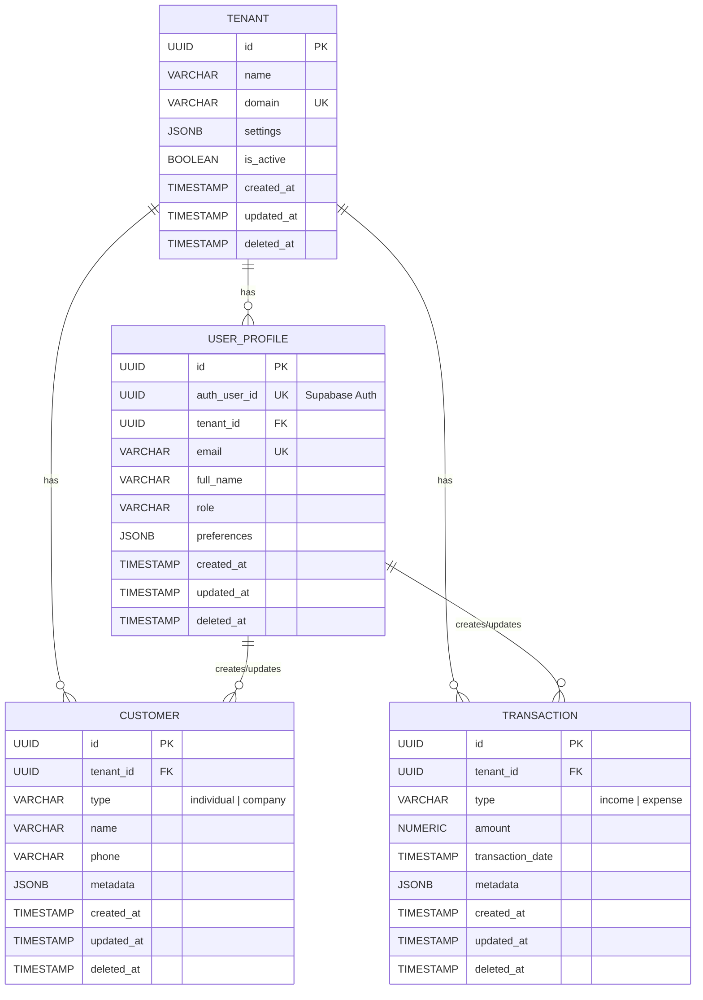

# Boshlang'ich Jadvallar Strukturasi (ERD)

Loyihaniz uchun qabul qilingan asosiy ERD strukturasi va xavfsizlik modeli (Supabase/PostgreSQL) bo'yicha hujjat.

## 1. Umumiy Qoidalar (Best Practices)
Barcha jadvallar uchun majburiy ustunlar kiritildi:
- `id`: `UUID PRIMARY KEY` tartibida generatsiya qilinadi (`gen_random_uuid()`).
- `tenant_id`: Multi-tenant tizimni qo'llab-quvvatlash uchun. RLS (Row-Level Security) da har bir foydalanuvchi faqat o'z `tenant_id`siga tegishli ma'lumotlarni ko'rishini ta'minlaydi.
- `metadata` (Yoki `settings` / `preferences`): `JSONB` formatida belgilanib, relatsion bo'lmagan, tez o'zgaruvchan qatorlar (biznes parametrlar) uchun ishlatiladi.
- Audit va Soft Delete: `created_at`, `updated_at`, `deleted_at`, `created_by`, `updated_by` kabi maydonlar kiritildi.
- Performance (Indexlar): Ko'p qidiriladigan `tenant_id`, `email`, va `transaction_date` lari indekssalandi (B-Tree).

## 2. ERD (Mermaid)

## 3. Fayllar ro'yxati
- `/tools/database_helper.sql`: Avtomat `updated_at` triggerini taminlash uchun yordamchi saqlangan-protseduralar funksiyasi (Function/Trigger). 
- `/supabase/migrations/00000_initial_schema.sql`: Jadvallar, constraint'lar va Row-Level Security (RLS) xavfsizlik siyosati o'rnatish skriptlari jamlangan SQL fayl.
